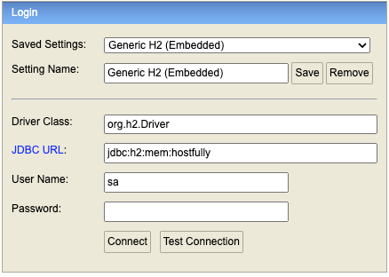
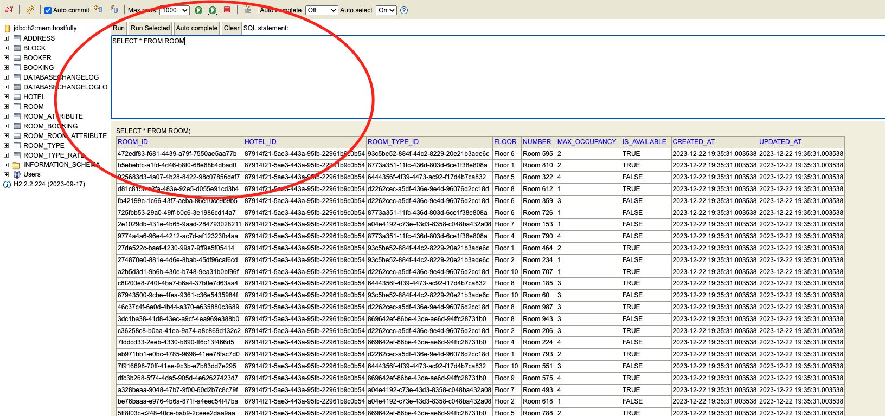
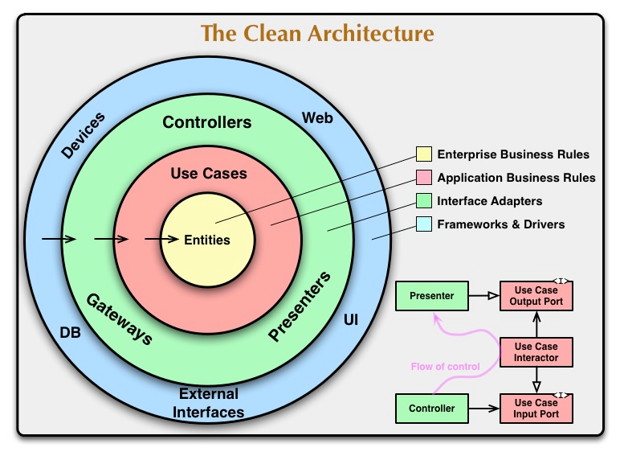

# BOOKING HOSTIFULLY

### How was the system was develop.

You can within a booking, book more than one room for the same book.
You can only book a rooms that are available 'IS_AVAILABLE=TRUE'. I've created it because It is recommended when you as a manager would like to unable that specific room for any reasons.
It also validates if the total amount of guests is supported by rooms.

I've created a status flow and process, but, you are able just to cancel the booking, not pay, refund and etc. It is just to show, we have to consider it within a real booking project 

All of others rules to book are implements as mentioned in the requirements of this challenge.

## Instructions to use

This project has some random data in terms of, Hotel, Rooms and theirs relationships.
I could create endpoints to retrieve those, but, It was not part of the challenge scope.
I created one Hotel and its fifth rooms.

To book, you should follow the steps below:

Run on terminal the script below:

```shell
sh application.sh
```
than, click in this link right [here](http://localhost:8080/h2-console)

You will see the form below: <br /><br />


### Fill it with the values below

| Fields      | Value                  |
|-------------|------------------------|
| `JDBC URL`  | jdbc:h2:mem:hostfully  |
| `User Name` | sa                     |

than, on the righ side text field as the image below the command
```sql
SELECT R.ROOM_ID,
       RT.NAME,
       RT.DESCRIPTION,
       RT.RATE_ADULT,
       RT.RATE_CHILDREN,
       R.MAX_OCCUPANCY,
       R.IS_AVAILABLE
FROM ROOM R,
     ROOM_TYPE RT
WHERE R.ROOM_TYPE_ID = RT.ROOM_TYPE_ID
```


The result of the SQL command will show you the rooms in the system. You will see, the properties of the rooms, max occupancy and etc. Keep it open because you will need during your tests.

### API Documentation

Access the swagger to make requests clicking [here](http://localhost:8080/swagger-ui/index.html#/)

## Block Management API

This API provides endpoints to perform CRUD operations on blocks.

### Endpoints

| Method | Endpoint                   | Description                 |
|--------|----------------------------|-----------------------------|
| POST   | `/blocks`                  | Create a new block          |
| PUT    | `/blocks/{blockId}`        | Update a specific block     |
| DELETE | `/blocks/{blockId}`        | Delete a specific block     |

### Booking Management API

This API provides endpoints to manage bookings.

#### Endpoints

| Method | Endpoint                            | Description                                           |
|--------|-------------------------------------|-------------------------------------------------------|
| POST   | `/bookings`                         | Create a new booking                                  |
| PUT    | `/bookings/{bookingId}`             | Update booking dates and guest details                |
| POST   | `/bookings/{bookingId}/cancelation` | Cancel a booking                                      |
| POST   | `/re-bookings/{bookingId}`          | Rebook a canceled booking                       |
| DELETE | `/bookings/{bookingId}`             | Delete a booking from the system                      |
| GET    | `/bookings/{bookingId}`             | Get details of a specific booking                     |
| GET    | `/bookings`                         | Retrieve all bookings                                 |

### Technical

This project demonstrates the implementation of Clean Architecture, a software design philosophy emphasizing maintainability and separation of concerns. Clean Architecture divides a system into layers, with clear boundaries, to enhance flexibility and testability.



### Overview
**Entities**:<br />
Represent core business entities with embedded business rules and logic.
<br />

**Use Cases (Interactors)**:<br />
Contain application-specific business rules and orchestrate data flow between entities and interfaces.
<br />

**Interfaces (Adapters)**:<br />
Connect use cases to external systems (e.g., databases, frameworks) and handle data conversion.
<br />

**Frameworks & Drivers**:<br />
Utilize external frameworks and tools such as web frameworks, databases, and UI components, maintaining flexibility and ease of replacement.
<br />

**Project Structure**<br />
The codebase is organized using Clean Architecture principles with distinct packages for domain entities, use cases, infrastructure (persistence and presentation), and the application entry point.
<br />

**Explanation**<br />
All of classes should have one method and specific responsibility. The name of the operation / action / responsibility goes to the name of the class, and the class should have just one method named execute.
The code speaks for itself, no need comments or any explanation, for example: <br>

```java
CreateBookingUseCase createBookingUseCase = new CreateBookingUseCase();
Booking booking = new Booking();
createBookingUseCase.execute(booking);
```
You can see in the example above, that piece of code is going to create a booking, because It is explicit.</br>
It is just an example the system is different.

If You would like to know more about Clean Architecture, [click here](https://blog.cleancoder.com/uncle-bob/2012/08/13/the-clean-architecture.html)

**Technologies**

* Java 17 as main programming language
* For tests, Groovy (Spock Framework). [Click here](https://spockframework.org/spock/docs/2.3/index.html)
* Framework Spring (Spring Boot)
* Database H2 in memory
* Liquibase for changelogs 
* Maven dependency managment