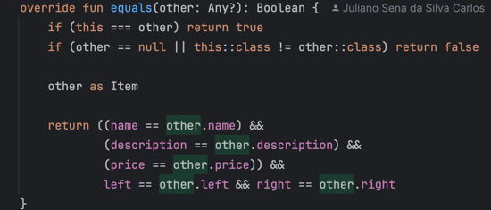

# Challenge

## Comparing trees

The algorithm use the equal to compare the objects. Making it recursively to traverse the tree on the equals of the item.

As you can see, I check if the properties are equal, and then I compare the left and right itens of that node, calling the equals again, but, for another node.